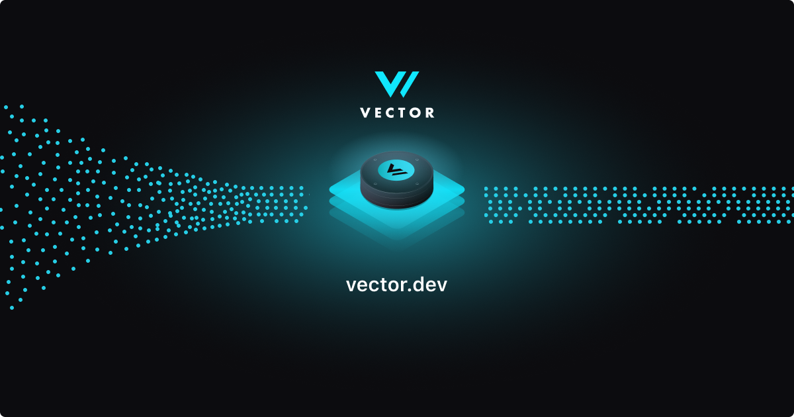
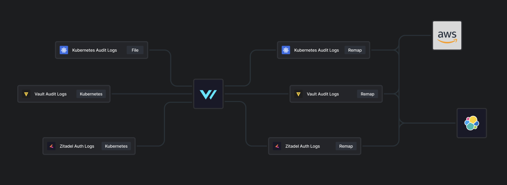

# vector-deployment

Vector agent & aggregator configurations for platform observability pipelines.

## Vector Overview

**Vector** is a lightweight tool by for building high performance observability pipelines for logs and metrics. Built by DataDog, it has many advanced features that make it a top tier choice for log aggregation:

- **Performance** — Vector is written in Rust, which gives it the speed and memory efficiency to handle high-volume event streams.

- **Programmable Transforms** — **Vector Remap Language (VRL**) can be used to handle complex customizations of events, such as renaming fields, perfoming calculations, and conditional routing.

- **Vendor Neutral** — Observability data can be shipped to over 60 destinations, including Elasticsearch, S3, CloudWatch, and Kafka.

## Deployment Architecture

This configuration has Vector deployed both as an **agent** and and **aggregator**.

### Roles

#### Agent

Agent configurations are located in `/config/agent`. The Vector agent is used to collect events from file-based locations, such as the host filesystem and Kubernetes pod logs. 

This is the more reliable approach to collect data from these types of sources because Vector is deployed as a **DaemonSet** on Kubernetes, which means that Kubernetes ensures an instance exists on every node in the cluster.

The Vector agent is configured to stream collected observability data to the Vector aggregator, which handles upstream processing before forwarding events to their destinations.

#### Aggregator

Aggregator configurations are located in `/config/aggregator`. The aggregator is used to collect event from network-based locations, such as sockets for syslogs from physical network devices.

As mentioned, the aggregator handles the more complex processing in the pipeline, such as remapping fields, filtering events, and routing to destinations.

The Vector aggregator is deployed as a `Deployment` on Kubernetes, meaning it can be autoscaled if necessary to handle the volume of incoming events.

***

### Event Stream

#### Sources

- Hubble Network Flow Logs
- Kubernetes Application Logs
- Kubernetes Audit Logs
- Vault Audit Logs

#### Transforms

1. Tag events with collection source and additional metadata (`@dataset`, `@namespace`) for upstream routing
2. Attempt to parse each event as JSON, since Vector rolls up collected logs under `.message`. If JSON parsing succeeds, the log fields are merged into the top level object to remove the `.message` key. Otherwise, the `.message` key and its plain string value are kept intact for querying.
3. Route events to their respective transform using `@source` and `@dataset` metadata with a `route` transform.
4. Use a targeted `remap` transform to streamline the schema of specific events (rename, move, drop, or normalize fields).

#### Sinks

- **Elastic** — Main SIEM and store for platform logs and metrics
- **S3** — Longer term archival storage for logs (Standard S3 with lifecyle rules for S3 Glacier)
- **Kafka** — Supports experimental but highly targeted event-driven security automations

## Security

The connection from the Vector agents to Vector aggregators is secured with mTLS. This is done to prevent the risk of an adversary pushing rogue or spoofed events to an aggregator to disrupt the observability pipeline.

## Tests

Vector configurations are tested with unit tests on a pull request. This ensures that configurations & transforms work as expected before they're deployed to the pipeline.

Tests for each type of Vector deployment can be found in their respective directory in `/tests` (`/tests/agent` & `/tests/aggregator`).

